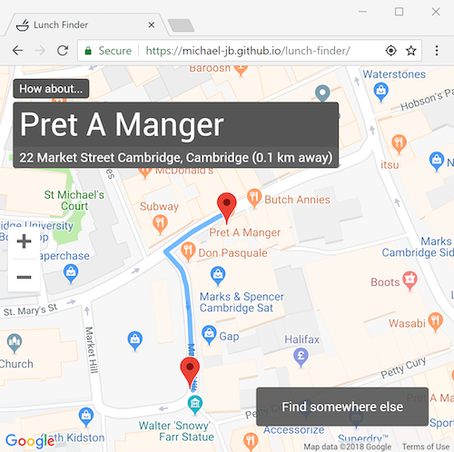

# lunch-finder

A web app which makes suggestions for places to eat at near to your location.
Powered by the Google Maps JavaScript API, the app will filter out distant or closed restaurants to provide a concise list for perusal.

## Usage

This app is designed to be statically served for simplicity.

- Add valid API key to `index.html`
- Serve this directory, e.g with `npx live-server` or `python -m SimpleHTTPServer 8000`

Please note that the API key is exposed to the client, so a more involved server would be required in production.

## License

[MIT license](./LICENSE)
